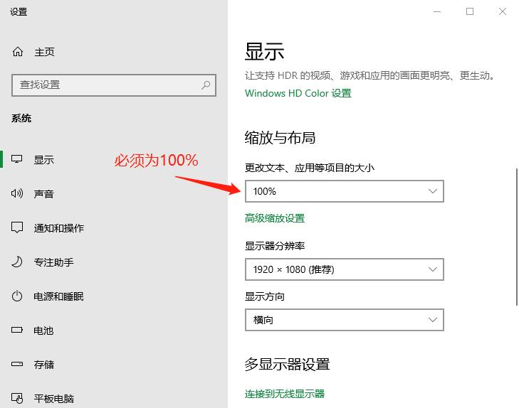
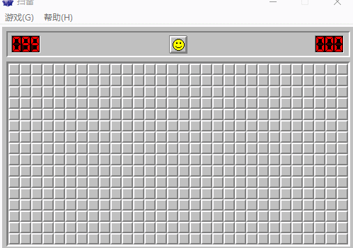
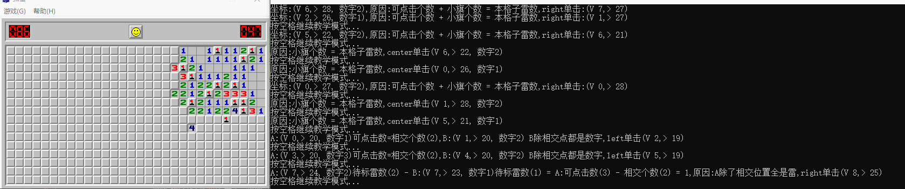

## 使用方法
1. 使用win32api因此只支持在window下运行
2. 使用截图分析,为精确像素识别,显示器缩放必须为100%,下图所示  

4. 确保先运行[winmine](winmine.exe)这个扫雷游戏
5. 执行`go run mine.go`,然后键盘输入'Y'或'N'选择模式
6. 当需要人工猜雷时,点击鼠标左键或右键完成一次操作即可

## 扫雷算法
扫雷算法
```text
1. X格子周围可点击数量 + X格子周围已标记雷数量 = X格子显示数值
    用右键将所有可点击位置标雷
2. X格子周围已标记雷数量 = X格子显示数值
    用中键点击X格子,点开非雷区域
3. 两个相邻格子待标雷数多的为A,待标雷数少的为B
    A待标雷数 - B待标雷数 = A可点击数 - AB 相交位置数
    A除相交位置以外的可点击位置全是雷,用右键全部标记为地雷
4. 两个相邻格子A和B待标雷数量相同,A的可点击数为a,B的可点击数为b,相交格子数为c
    如果a = c,则格子B除开相交位置的可点击位置一定不是雷
    如果b = c,则格子A除开相交位置的可点击位置一定不是雷
5. todo 发现更精确扫雷方法
6. todo 发现更精确猜雷方法
```
下面是效果图



## 教学模式
使用教学模式会将鼠标定位到操作位置,并打印这样做的原因,方便使用者学习如何扫雷,
如何分析该用鼠标[左,中,右]键点击哪个位置。

下图所示，坐标`V`表示向下格子数,坐标`>`表示向右格子数


## 关于猜雷
```text
猜测某个点没有雷,运气成分,如需提高胜率可优化下面代码,下面是关于猜雷的思路
1.(https://tieba.baidu.com/p/1761431400?red_tag=3267954760)
  (https://zhuanlan.zhihu.com/p/35974785)
  上面是我看到比较靠谱的理论,由于计算机虽然笨但运算快,因此我打算实现这个方案
2.死猜,及无论如何都不可能判定哪个是雷,那就只能随机猜一个了
3.这里还要注意一点,及剩余雷数,有时候根据剩余雷数可以提高胜率
按照上面3个步骤,还没发确定是不是雷,妈逼只能靠运气了

到处找教程最终没能找到一个好点的方案,还是随机点击一个位置
```
* 最终没有找到合适猜雷方案,因此自动猜雷只是随机一个位置点左键
* 还有就是开局,网上也有很多开局技巧,例如先点四个角。我还是用随机点,机器随机比人惯性思维好吧。
